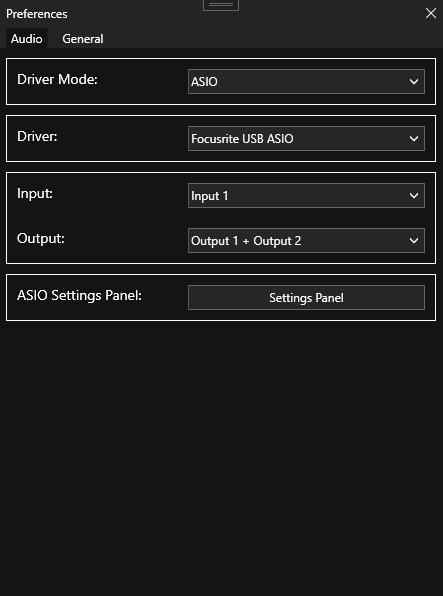
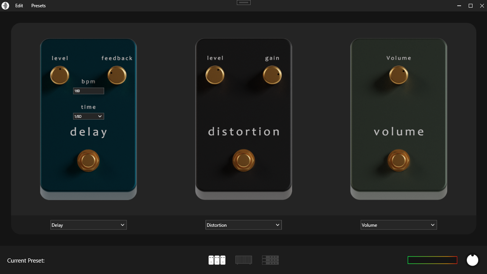
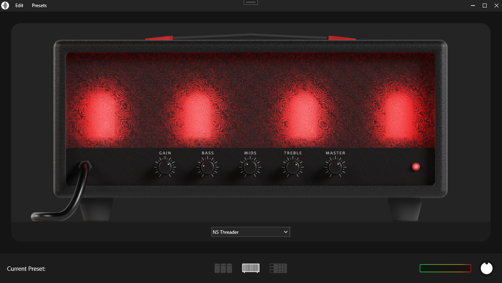
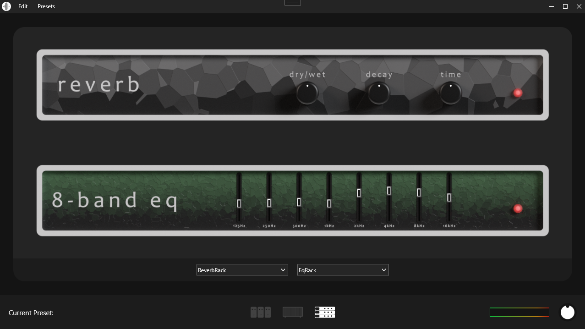
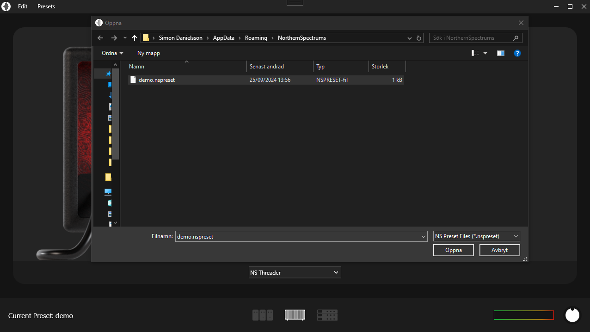

# NorthernSpectrums

## Table of contents

* [Introduction](#introduction)
* [Application](#application)
* [Features](#features)
  1. [Input](#input)
  2. [Pedal Board](#pedal-board)
  3. [Amplifier](#amplifier)
  4. [Racks](#racks)
  5. [Presets](#presets)

## Introduction 
This repository shawcases the result of the 1DV613 Course from Linnaeus University.
During the course we worked on an individual project for 10 weeks. The aim of the course was to familiarize us with working on projects in a structured manner. Going from a project vision to
working on implementation and testing in sprints, finally ending with deploying what we had at the end of the course.

This repository only contains the source code for the application developed during the course. Any course specific files/documentation will not be published in this repository.

## Application 
Northern Spectrums is a digital guitar amplifier built as a [WPF](https://learn.microsoft.com/en-us/dotnet/desktop/wpf/overview/?view=netdesktop-8.0) application with a [MVVM](https://learn.microsoft.com/sv-se/dotnet/architecture/maui/mvvm) like structure.

## Features 

### Input 

The application supports any devices using ASIO drivers and allows users to choose between available ASIO devices, inputs and outputs.

### Pedal Board 

The Pedal Board allows users to choose between three different pedals and assamble them in any preferable order.

### Amplifier 

The application comes with a high distortion amplifier.

### Racks 

The Rack section allows users to choose between two racks and assemble them in any preferable order.

### Presets 

Presets allows users to save their custom signal chains.

